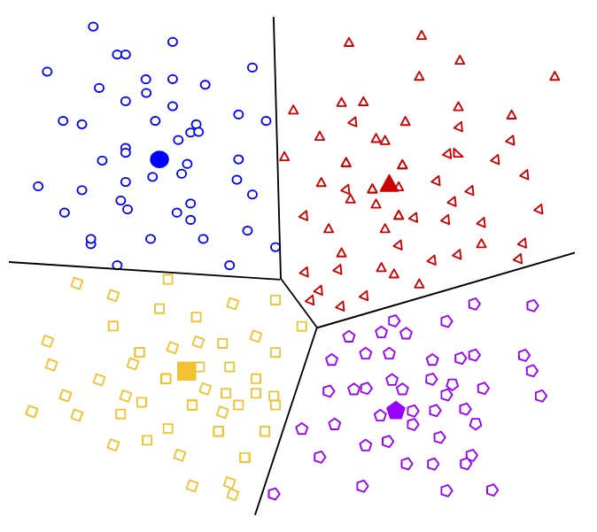
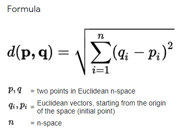
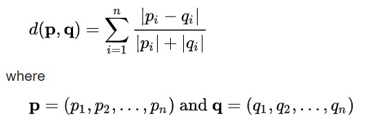

```{r setup, include=FALSE}
knitr::opts_chunk$set(echo = TRUE)
```
******
# Introducció
******
## Presentació
Aquesta pràctica cobreix de manera transversal l'assignatura.

Les Pràctiques 1 i 2 de l'assignatura es plantegen d'una forma conjunta de manera que la Pràctica 2 serà continuació de la 1.

L'objectiu global de la **Pràctica 2** és d'extreure coneixements i de comparar les diferents solucions aplicant tot l'après mitjançant els algorismes de clustering, associació i classificació.

## Competències
Les competències que es treballen en aquesta prova són:

* Ús i aplicació de les TIC en l'àmbit acadèmic i professional.
* Capacitat per a innovar i generar noves idees.
* Capacitat per a avaluar solucions tecnològiques i elaborar propostes de projectes tenint en compte els recursos, les alternatives disponibles i les condicions de mercat.
* Conèixer les tecnologies de comunicacions actuals i emergents així com saber-les aplicar convenientment per a dissenyar i desenvolupar solucions basades en sistemes i tecnologies de la informació.
* Aplicació de les tècniques específiques d'enginyeria del programari en les diferents etapes del cicle de vida d'un projecte.
* Capacitat per a aplicar les tècniques específiques de tractament, emmagatzematge i administració de dades.
* Capacitat per a proposar i avaluar diferents alternatives tecnològiques per a resoldre un problema concret.

## Objetius
La correcta assimilació de tots els aspectes treballats durant el semestre.
En aquesta pràctica abordem un cas real de mineria de dades on hem de posar en joc tots els conceptes treballats.
Cal treballar tot el cicle de vida del projecte. Des de l'objectiu del projecte fins a la implementació del coneixement trobat passant per la preparació, neteja de les dades, coneixement de les dades, generació del model, interpretació i avaluació.

## Descripció de la PRA a realitzar
La pràctica consta d'exercicis en els quals l'estudiant aplicarà alguns dels mètodes supervisats i no supervisats apresos durant el semestre.

## Recursos Bàsics
Material docent proporcionat per la UOC. 

## Criteris de valoració

**Exercicis pràctics** 

Per a totes les PRA és necessari documentar en cada apartat de l'exercici pràctic que s'ha fet i com s'ha fet.

## Format i data d'entrega
El format d'entrega és: **usernameestudiante-PRA2** *.Rmd* i el **output generat** en un d'aquests formats html/*doc/docx/odt/pdf*.

Data de lliurament: **16/06/2021**

S'ha de lliurar la PRA en la bústia de lliuraments de l'aula en format comprimit que inclou els fitxers:
- executable
- output
- el dataset seleccionat o en defecte d'això indicar la ruta per a la seva descàrrega en l'executable.

## Nota: Propietat intel·lectual

> Sovint és inevitable, en produir una obra multimèdia, fer ús de recursos creats per terceres persones. És per tant comprensible fer-ho en el marc d'una pràctica dels estudis d'Informàtica, Multimèdia i Telecomunicació de la UOC, sempre que això es documenti clarament i no suposi plagi en la pràctica.

> Per tant, en presentar una pràctica que faci ús de recursos aliens, s'ha de presentar juntament amb ella un document en el que es detallin tots ells, especificant el nom de cada recurs, el seu autor, el lloc on es va obtenir i el seu estatus legal: si l'obra aquesta protegida pel copyright o s'acull a alguna altra llicència d'ús (Creative Commons, llicència GNU, GPL ...).
L'estudiant haurà d'assegurar-se que la llicència no impedeix específicament el seu ús en el marc de la pràctica. En cas de no trobar la informació corresponent haurà d'assumir que l'obra aquesta protegida per copyright.

> Haureu, a més, adjuntar els fitxers originals quan les obres utilitzades siguin digitals, i el seu codi font si correspon.

******
# Enunciat
******
Com a continuació de l'estudi iniciat en la pràctica 1, procedim a **aplicar models analítics** sobre el joc de dades seleccionat i preparat. En aquesta pràctica 2 s'aconsella d'adjuntar els “chunks” de la part de preparació prèvia, exemple (neteja, discretizació, normalització, PCA/*SVD etc.), o en defecte d'això carregar només les dades ja preparades

D'aquesta manera es demana a l'estudiant que completi els següents passos:

1. Aplicar un model **no supervisat** i basat en el concepte de distància, sobre el joc de dades.

2. Aplicar de nou el model anterior, però usant una **mètrica diferent** i comparar els resultats.

3. Raonar si té sentit aplicar al dataset seleccionat, un mètode de **generació de regles d'associació**. En cas afirmatiu, realitzar tal procés i explicar els resultats. En cas contrari, reformula el problema perquè sí que el tingui.

4. Aplicar un model de generació de regles a partir de **arbres de decisió** sense i amb opcions de poda i comparar els resultats.

5. Aplicar una millora amb **tècniques de boosting** i comparar el resultat amb l'anterior.

6. Identificar eventuals **limitacions** del dataset seleccionat i **analitzar els riscos** per al cas d'ús.

7. (Punt comú per a tots els exercicis) -
En tots els punts anteriors es demana a l'estudiant, a més d'aplicar els diferents mètodes, d'analitzar correctament el problema, **detallar de manera exhaustiva** ressaltant el perquè i com s'ha realitzat, incloent elements visuals, explicant els resultats, realitzar les comparatives oportunes amb les seves conclusions.


******
# Criteris d'avaluació
******

* Exercici 1 (25%)
	- Es genera un model no supervisat.
  - S'analitzen, mostren i comenten les mesures de qualitat del model generat.
  - Es comenten les conclusions.

* Exercici 2 (10%)
	- Es genera de nou el model no supervisat anterior, però usant una mètrica de distància diferent.
  - Es mostren i comenten les mesures de qualitat del model generat.
  - Addicionalment es comparen els dos models no supervisats amb mètriques de distància diferents.
  - Es comenten les conclusions.
	
* Exercici 3 (10%)
  - Es representa, analitza i comenta un exemple de regles d'associació aplicat al dataset seleccionat, o en defecte d'això es reformula el problema (mínim de 250 paraules).
  - Es comenten les conclusions.

* Exercici 4 (25%)
  - Es generen regles i es comenten i interpreten les més significatives.
  - Extraiem les regles del model en format text i gràfic.
  - Addicionalment es genera matriu de confusió per a mesurar la capacitat predictiva de l'algorisme.
  - Es comparen i interpreten els resultats sense i amb opcions de poda, explicant els avantatges i inconvenients del model generat respecte a un altre mètode de construcció.
  - S'avalua la taxa d'error en cada nivell d'arbre, l'eficiència en classificació (en les fases de training, validació i test) i la comprensibilitat.
  - Es comenten les conclusions.

* Exercici 5 (10%)
  - S'aplica una millora amb tècnica de boosting.
  - Es detalla, comenta i avalua la qualitat de classificació.
  - Es comparen i comenten els resultats de manera exhaustiva amb l'anterior mètode de construcció.

* Exercici 6 (10%)
  - Identifica quines possibles limitacions tenen les dades que has seleccionat per a obtenir conclusions amb els models (supervisat i no supervisat)
  - S'identifiquen possibles riscos de l'ús del model (mínim 250 paraules).
  
* Consideració general (10%) 
  - Es presenta el codi i és fàcilment reproduïble.
  - Es detalla cada pregunta de manera correcta, mostrant el codi, comentant com s'ha fet i perquè s'ha fet, comparant els resultats i/o indicant altres alternatives al problema indicat.
  - Es mostren les conclusions en cada apartat.
  - S'indiquen eventuals citacions bibliogràfiques, fonts internes/externes i materials de recerca.

******
# Recursos de programació
******
* Incloem en aquest apartat una llista de recursos de programació per a mineria de dades on podreu trobar exemples, idees i inspiració:
  + [Material addicional del llibre: Mineria de dades Models i Algorismes](http://oer.uoc.edu/libromd/)
  + [Espai de recursos UOC per a ciència de dades](http://datascience.recursos.uoc.edu/es/)
  + [Cercador de codi R](https://rseek.org/)
  + [Col·lecció de cheatsheets en R](https://rstudio.com/resources/cheatsheets/)
  + [Introducing Clustering II: Clustering Algorithms](https://gameanalytics.com/blog/introducing-clustering-ii-clustering-algorithms/)
  + [Clustering Algorithms](https://developers.google.com/machine-learning/clustering/clustering-algorithms)
  + [K-means Cluster Analysis](https://uc-r.github.io/kmeans_clustering#silo)
  
  

******
# Implementació 
******

## Càrrega de les dades i llibreries

Carregem llibreries.

```{r message= FALSE, warning=FALSE}
#https://cran.r-project.org/web/packages/ggplot2/index.html
if (!require('ggplot2')) install.packages('ggplot2'); library('ggplot2')
# https://cran.r-project.org/web/packages/dplyr/index.html
if (!require('dplyr')) install.packages('dplyr'); library('dplyr')
if (!require(cluster)) install.packages(cluster);library(cluster)
if(!require(MVA)) install.packages("MVA"); library(MVA)
if(!require(tidyr)) install.packages("tidyr");library(tidyr)
if(!require(cluster)) install.packages("cluster"); library(cluster)
if(!require(plyr)) install.packages("plyr"); library(plyr)
if(!require(readr)) install.packages("readr"); library(readr)
```

Carregem tots els arxius de dades en un únic DataFrame. 

```{r message= FALSE, warning=FALSE}
#IMPORT DATA - src: https://opendata-ajuntament.barcelona.cat/data/ca/dataset/est-atur-pes

#List of all files - https://datascienceplus.com/how-to-import-multiple-csv-files-simultaneously-in-r-and-create-a-data-frame/
mycsvfiles = list.files(pattern="*.csv", full.names=TRUE)
mycsvfiles

#DataFrame creation with all data from files list
datafromcsv = ldply(mycsvfiles, read_csv)
#Setting headers
colnames(datafromcsv) <- c("Any", "Mes", "CodiDistricte", "NomDistricte", "CodiBarri", "NomBarri", "Poblacio", "PesAtur")

#Filter by only numeric data
numericData <- datafromcsv %>% select(is.numeric)
#Number of rows
numericRows = dim(numericData)[1]
```

```{r message= FALSE, warning=FALSE}

```

## Model no supervistat

Els models no supervisats són algorismes que apliquen regles d'agregació per tal d'intentar trobar una estructura dins d'un conjunt de dades no etiquetades. Un dels models més coneguts en la funció de detectar la semblança entre objectes d'un conjunt de dades és __k-means__. Aquest algorisme forma part de la família del ___Centroid-based clustering___ que agrupa elements a través del càlcul de distàncies entre els centres dels clústers. K-means és tan extensament utilitzat, ja que és molt eficient, efectiu i simple tot i ser bastant sensible a les condicions inicials i els outliers. Normalment el càlcul de distàncies s'efectua a través de la distància euclidiana.

{#id .class width=75% height=75%}

Inicialment treballarem amb aquest algorisme, però més endavant utilitzarem altres algorismes d'altres famílies per poder comparar resultats i obtenir una visió més amplia i global de les nostres dades per acabar realitzant un estudi més precís.


Abans de realitzar la implementació d'aquest algorisme, comprovarem com es distribueixen els valors del atur en cada un dels barris al llarg del temps per tal de considerar si és una bona opció plantejar, que cada un dels barris té un comportament particular en la relació 'població activa - atur'.

```{r message= FALSE, out.width="125%", warning=FALSE}
#List of name that we are going to use and filter by these fields
barriPoblAturNames <- c("CodiBarri", "Poblacio", "PesAtur")
barriPoblAtur <- select(numericData, barriPoblAturNames)

#Point plot by using the relation poblation-unemployment
pobAturPlot <- ggplot(barriPoblAtur, aes(Poblacio, PesAtur)) + geom_point(aes(color=CodiBarri))
pobAturPlot
```

A través del plot anterior poden visualitzar que cada un dels barris tendeix a seguir una tendència particular que es veu reflectida en una col·lecció de punts verticals que descriu la fluctuació de l'atur per cada un d'aquests, juntament amb una variació molt lleugera en termes de població. És per això que té molt de sentit aplicar un model no supervisat sobre aquest conjunt de dades per tal de poder confirmar aquest comportament i detectar els diferents conjunts d'elements semblants dins el nostre domini. Per a realitzar aquesta comprovació utilitzarem diferents tècniques i criteris.


### Average Silhouette Method

El primer mètode que utilitzarem per a aproximar el valor òptim corresponent al nombre de clústers pel nostre conjunt de dades és el de la ___silueta mitjana___. Aquest mètode determina que encertat és situar cada un dels objectes a un valor __k__ de clústers, calculant el valor mitjà per un conjunt de valors diferents __k__. Un valor mitjà alt de la silueta indica una bona agrupació, mentre que un valor baix indica el contrari.
Inicialment aplicarem l'algorisme __kmeans__ amd diferents valors __k__. Amb els càlculs resultants obtindrem la silueta mitjana per cada valor __k__. Finalment observarem els resultats en format gràfic i seleccionarem el valor més alt. 

```{r message= FALSE, out.width="125%", warning=FALSE}
# Compute and plot wss for k = 2 to k = 73
k.values <- 2:73

# Extract avg silhouette for 2-73 clusters
result <- rep(0,73)
for( i in k.values ){
  km.res <- kmeans(barriPoblAtur[1:3], centers = i)
  sk <- silhouette(km.res$cluster, dist(barriPoblAtur[1:3]))
  result[i]<-mean(sk[, 2])
}
#Print max value
print(max(result))
#Print the index of max value
which.max(result)

#Plot Average Silhouette
plot(2:73, result[2:73],
    type = "b", pch = 19, frame = FALSE,
    main = "Average Silhouette Method",
    xlab = "Number of clusters K",
    ylab = "Average Silhouettes") +
abline(h = max(result))

#Clusters distribution plot
clusplot(barriPoblAtur[2:3], km.res$cluster, color=TRUE, shade=TRUE, labels=2, lines=0)
```
_Warning: Aquest valor és variable degut al fet que ens trobem executant l'algorisme kmeans que té un factor aleatori._

Els resultats obtinguts ens indiquen que el valor òptim __k__ correspon a 73, ja que és el valor més repetit al llarg de les execucions. Aquest valor confirma les nostres prediccions prèvies, tot i això aplicarem un segon mètode per poder comparar resultats.

### Calinski-Harabasz Index

El segon mètode que utilitzarem és el criteri __Calinski-Harabasz__. Aquest mètode igual que l'anterior, ens permet determinar el valor ___k___ òptim del nostre conjunt de dades mitjançant l'execució de l'algorisme __kmeans__.

```{r message= FALSE, out.width="125%", warning=FALSE}
if(!require(fpc)) install.packages(fpc); library(fpc)

#Calinski-Harabasz criterion computation
fit_ch  <- kmeansruns(barriPoblAtur, krange = 1:73, criterion = "ch")

#Print best K value
print(fit_ch$bestk)

#Calinski-Harabasz plot
plot(1:73, fit_ch$crit,
     main = "Calinski-Harabasz Index",
     type = "b", pch = 19, frame = FALSE,
     xlab = "Number of clusters K",
     ylab = "Average Silhouettes") + 
abline(h = (fit_ch$bestk))

#Clusters distribution plot
plot(barriPoblAtur, col=fit_ch$cluster)
clusplot(barriPoblAtur[2:3], fit_ch$cluster, color=TRUE, shade=TRUE,labels=2, lines=0)
```

_Warning: Aquest valor és variable degut al fet que ens trobem executant l'algorisme kmeans que té un factor aleatori._

Tot i el que hem matisat anteriorment, el valor que més s'ha repetit durant el llarg de les execucions és 73.

Així doncs, donat que el resultat d'aquest criteri és molt similar a l'anterior, podem afirmar que amb l'ús de mètodes d'agregació no supervisats basats en el càlcul dels centroides, trobem que el nombre de clústers dins del nostre conjunt de dades es troba directament relacionat amb la quantitat de barris, és a dir, un clúster per a cada barri.

### Average Silhouette Method - Different Metrics

A continuació treballarem amb el mateix mètode de la silueta mitjana, pero canviarem la mètrica del càlcul de la distància de l'algorisme __k-means__. Per defecte aquest utilitza la distància euclidiana.

{#id .class width=25% height=25%}

#### Canberra Distance

Utilitzant la llibreria __'amap'__ podem modificar la mesura de distància utilitzada dins del nostre algorisme __k-means__ entre dos punts. A continuació modificarem aquesta paràmetre i utilitzarem la 'Canberra Distance' definida de la següent manera:

{#id .class width=50% height=50%}

```{r message= FALSE, out.width="125%", warning=FALSE}
#Loading library
# https://www.rdocumentation.org/packages/amap/versions/0.8-18/topics/Kmeans
# https://rdrr.io/cran/amap/man/dist.html
if(!require(amap)) install.packages("amap"); library(amap)

# Compute and plot wss for k = 2 to k = 73
k.values <- 2:73
result <- rep(0,73)
# Extract avg silhouette for 2-73 clusters
for( i in k.values ){
  km.res <- Kmeans(barriPoblAtur[1:3], centers = i, method = "canberra")
  sk <- silhouette(km.res$cluster, dist(barriPoblAtur[1:3]))
  result[i]<-mean(sk[, 2])
}
#Print max value
print(max(result))
#Print the index of max value
which.max(result)

#Plot Average Silhouette - Canberra Distance
plot(2:73, result[2:73],
     type = "b", pch = 19, frame = FALSE,
     main = "Average Silhouette Method - Canberra Distance",
     xlab = "Number of clusters K",
     ylab = "Average Silhouettes")

```

_Warning: Aquest valor és variable degut al fet que ens trobem executant l'algorisme kmeans que té un factor aleatori._

Els resultats obtinguts ens indiquen que tot i que haver modificat el mètode del càlcul de la distància, obtenim un resultat pràcticament igual. Així doncs, les conclusions extretes anteriorment queden reforçades.

Per altra banda, una altra manera de comprovar la validesa de les conclusions extretes és aplicar mètodes i algorismes de clustering que formen part d'alguna altra família com pot ser el Mètode d'agrupaments jeràrquics.

## Regles d’associació

Les regles d'associació són mètodes que ens permeten trobar i descobrir relacions/dependències entre variables dins un domini mitjançant una expressió lògica.

A continuació comentarem un conjunt de regles d'associació que podem trobar dins el nostre data set i posteriorment les computarem per veure si les previsions prèvies tenien sentit o no.
El nostre estudi de mineria de dades es troba enfocat en analitzar la relació que trobem entre la població laboralment activa de la ciutat de Barcelona i l'atur amb dades segmentades en districtes i barris. Així doncs podem plantejar que les zones més castigades per l'atur durant els últims anys són aquelles que disposen de menys recursos. Situant-nos sobre el mapa de la ciutat de Barcelona, els barris que tendeixen a reflectir aquestes característiques, són les zones més antigues i a la vegada, els barris que es troben als districtes més propers a la zona del Besòs.

### Còmput de les regles d'associació

Inicialment podem provar d'analitzar tot el conjunt de dades numèriques a veure quines són les regles generades i si aquestes ens aporten algun tipus d'informació.

```{r message= FALSE, warning=FALSE}
#Loading libraries
if (!require('arules')) install.packages('arules'); library('arules')

#Numeric raw data
numericData_rules <- apriori(numericData, parameter = list(support = 0.01, confidence = 0.5))
summary(numericData_rules)
inspect(head(sort(numericData_rules, decreasing = TRUE, by = "confidence"), 10))
```

Observem que obtenim un total de 1475 regles, una xifra completament desorbitada. Així doncs, podem concloure que amb aquestes regles no podem extreure gens d'informació.

A continuació farem un anàlisi de les regles filtrant les dades de població i atur per districte, i seguidament per barri.

```{r message= FALSE, warning=FALSE}
#Filtering data by Districte - distPoblAtur
distPoblAturNames <- c("CodiDistricte", "Poblacio", "PesAtur")
distPoblAtur <- select(numericData, distPoblAturNames)

###pobAturDistricte
PobAturDistricte_rules <- apriori(distPoblAtur, parameter = list(support = 0.01, confidence = 0.5))
summary(PobAturDistricte_rules)
inspect(PobAturDistricte_rules)
```

Els resultats que hem obtingut formen un conjunt de 18 regles, un nombre molt més reduït i molt més analitzable. Abans d'entrar en l'anàlisi de les regles, és necessari realitzar una taula per associar el districte amb el seu identificador, per poder realitzar una millor lectura de les dades. 

Districtes (rang barris): 

1. Ciutat Vella (1-4)
2. Eixample (5-10)
3. Sants - Montjuïc (11-18)
4. Les Corts (19-21)
5. Sarrià - Sant Gervasi (22-27)
6. Gràcia (28-32)
7. Horta - Guinardó (33-43)
8. Nou Barris (44-56)
9. Sant Andreu (57-63)
10. Sant Martí (64-73)

Dins el conjunt de regles, observem que certa part de les prediccions s'han complert. Les regles ens confirmen que les zones més castigades són les que es situen a la zona propera al Besòs amb un atur que se situa de forma mitjana entre el 10 i 22%. Per altra banda, les zones cèntriques i nord són les que tenen un atur mitjà molt més reduït entre el 3 i 7%. A continuació farem un anàlisi més focalitzat per barris.

```{r message= FALSE, warning=FALSE}
###pobAturBarri
PobAturBarri_rules <- apriori(barriPoblAtur, parameter = list(support = 0.01, confidence = 0.5))
summary(PobAturBarri_rules)
inspect(PobAturBarri_rules)
```

El nombre de regles obtingudes és d'un total de 12. La lectura d'aquestes és pràcticament idèntica a l'obtinguda a la dels districtes. Els barris més castigats són els de la zona del Besòs, així també com els més poblats dins la ciutat de Barcelona.

## Model predictiu

En aquest apartat generarem un model predictiu basat en arbres de decisió per tal de predir nous valors d'entrada, i poder-los classificar seguint les regles del nostre conjunt de dades actual.
Inicialment realitzarem la divisió del conjunt de dades entre el conjunt d’entrenament i el conjunt de test. El conjunt d’entrenament ens permetrà entrenar el nostre model, mentre que el conjunt de test, ens permetrà verificar el funcionament del model i avaluar la qualitat d’aquest.

```{r message= FALSE, warning=FALSE}
#Creating a seed
set.seed(101)
trainRows = numericRows * 0.1
#Creating training indexes
train_indexes <- sample(numericRows, trainRows)
#Create training sample 
atur_train <- barriPoblAtur[train_indexes, ]
#Creating test sample
atur_test  <- barriPoblAtur[-train_indexes, ]
```

En el conjunt de test ens hem quedat amb el 10% dels registres totals, mentre que la resta els farem servir de test. 

```{r message= FALSE, warning=FALSE}
#Load of C50 library
if (!require(C50)) install.packages(C50);library(C50)
#'default' to a factor
atur_train$PesAtur<-as.factor(atur_train$PesAtur)
#Model creation
model <- C50::C5.0(atur_train[-3], atur_train$PesAtur,rules = TRUE)
#Summary of the model
summary(model)
```

Un cop hem executat el model, observem que la quantit de regles de classificació és molt gran. A continuació observarem com queda l'arbre de decisió.

```{r message= FALSE, warning=FALSE}
# #Plot the decision tree of the model
model <- C50::C5.0(atur_train[-3], atur_train$PesAtur)
plot(model)
```

Finalment realitzarem l'anàlisi sobre el conjunt de test i la matriu de confusió.

```{r message= FALSE, warning=FALSE}
#Precision computation
predicted_model <- predict(model, atur_test, type="class")

summary(predicted_model)

if(!require(gmodels)){
  install.packages('gmodels', repos='http://cran.us.r-project.org')
  library(gmodels)
}
# Uncomment to see values
# CrossTable(atur_test$PesAtur, predicted_model,
#            prop.chisq = FALSE, prop.c = FALSE, prop.r = FALSE,
#            dnn = c('Reality', 'Predicted')) 
```

Després de realitzar la prova, observem que el classificador generat té un 0% d'efectivitat. Aixó és degut a que la predicció que es proposa a realitzar és la de l'atur exacte a través d'un conjunt de regles i aixó el fa molt ineficient. 
Previament he intentat realitzar proves per tal de veure quines eren les dimensions que em permetrien obtenir una millor predicció i aquestes són les que "millor" han sortit.
